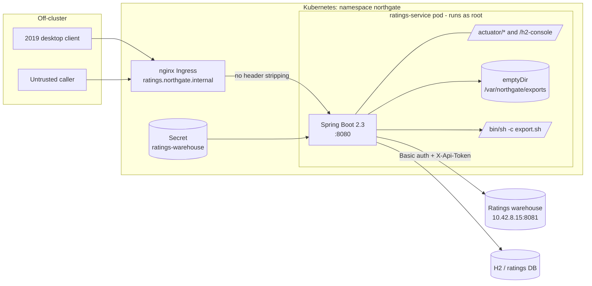

# Threat model: Northgate Ratings Platform

Scope: `ratings-service` 1.4.2 as committed, the container image built from
`ratings-service/Dockerfile`, and the Kubernetes deployment under `deploy/`. The pipeline
(`.github/workflows/`, `azure-pipelines.yml`) is in scope as the supply chain that produces
the image. The warehouse, the H2/production database and the 2019 desktop client are
external entities: their internals are out of scope, the interfaces to them are not.

Method: STRIDE per element over the data flow below, then a risk table. Ratings are
qualitative (likelihood x impact) and assume the deployment as it exists in `deploy/`, not
as the code comments describe it. The repository is synthetic and every finding under
`security/` is fabricated, but the code defects the threats point at are real defects in
the code as written.

## Assets

| Asset | Where it lives | Why an attacker wants it |
| ----- | -------------- | ------------------------ |
| Issuer credit grades | `ratings` table, `/api/ratings/*`, `/api/admin/*` | Pre-publication grade changes are market-moving; integrity matters more than confidentiality |
| Warehouse service account | `WarehouseClient` constants, `application.yml`, `Dockerfile` `ENV`, `ratings-warehouse` Secret | Lateral movement into the warehouse, which is the system of record for pre-2019 data |
| Desk session state | `ng_session` cookie, serialised `SessionState` | Carries the `admin` flag; forging it becomes privilege escalation once anything authorizes on it |
| Export files | `/var/northgate/exports`, `emptyDir` volume | Contains desk-scoped extracts; the download endpoint reads arbitrary paths |
| Service execution context | Container, running as root | Process environment carries the warehouse credential (`envFrom` the `ratings-warehouse` Secret); root widens post-exploitation options |
| Ops console credential | `OPS_CONSOLE_PASSWORD_HASH` in `SessionController` | Unsalted-format MD5 of the admin password, offline-crackable |

## Data flow

Trust boundaries, in the order an attacker crosses them:

1. **Ingress -> service.** The only perimeter. `deploy/k8s/ingress.yaml` no longer sets or
   strips `X-Internal-Admin`, so this boundary carries no authentication and no header
   normalisation.
2. **Request -> session identity.** `SessionCookieCodec` deserialises attacker-controlled
   bytes to establish identity; the boundary is crossed inside `ObjectInputStream.readObject`.
3. **Service -> SQL.** `RatingsRepository` concatenates request values into statements.
4. **Service -> OS.** `ExportController` builds a `/bin/sh -c` string and resolves file
   names, both from request parameters, as root.
5. **Service -> warehouse.** A static, never-rotated credential set, over plaintext HTTP.
6. **Pipeline -> image.** The gate is the only control between a commit and a published
   image; it reads the working tree rather than the exports.

## STRIDE by element

### Ingress and admin surface (`AdminApiFilter`, `AdminController`)

- **Spoofing / Elevation of privilege.** `AdminApiFilter.doFilter` reads
  `X-Internal-Admin`, logs the result, and calls `chain.doFilter` unconditionally — the
  boolean is never acted on. Nothing at the ingress strips the header either, so
  `/api/admin/*` is effectively anonymous. Consequences: `POST /api/admin/ratings/{id}/override`
  rewrites any published grade, and `GET /api/admin/warehouse/{id}` turns the service into
  a confused deputy that replays the warehouse credential for arbitrary issuers.
- **Repudiation.** The filter's only output is a log line built from the unvalidated
  `X-Forwarded-User` header, so the audit trail records whatever the caller claims, and
  CRLF in that header lets an attacker forge or split log entries.

### Session handling (`SessionCookieCodec`, `SessionController`, `LegacyDigest`)

- **Tampering / Elevation of privilege.** The cookie is base64 of a serialised
  `SessionState` with no MAC, so re-encoding one with `admin=true` is trivial (see the
  scope note below for what that currently buys). Independently,
  `decode` calls `ObjectInputStream.readObject` on the cookie, which is remote code
  execution given a gadget on the classpath — and `commons-collections` 3.2.1 and
  `guava` 24.1-jre, both pinned in the parent POM, are the classic gadget sources.
- **Information disclosure.** `SessionController.login` builds the `Cookie` by hand and
  never calls `setHttpOnly`/`setSecure`, so the cookie is script-readable and travels in
  cleartext. (The `server.servlet.session.cookie.*` settings in `application.yml` only
  govern the container's `JSESSIONID`, which this service does not use, so they are
  misleading rather than causal.)
- **Spoofing.** `LegacyDigest.hashPassword` is MD5 with the username as salt, so
  `OPS_CONSOLE_PASSWORD_HASH` is offline-crackable. `newSessionId` uses `java.util.Random`
  (predictable from ~2 observed values) but the value is only echoed in the login response
  and never stored or accepted anywhere, so it is latent debt rather than a live threat.
  `LegacyDigest.encryptField` is DES/ECB under the hardcoded 8-byte key `n0rthg8t`.
- **Scope of the `admin` flag.** Today the flag is read only by `whoami`; no endpoint
  authorizes on it. Cookie forgery is therefore an integrity defect with no privilege
  consequence *until* mitigation 1 below moves admin authorization onto the session —
  at which point an unsigned cookie becomes the critical path. The two must be fixed
  together.

### Ratings and reports (`RatingsRepository`, `ReportController`)

- **Tampering / Information disclosure.** Every statement in `RatingsRepository` is string
  concatenation: `findByIssuerId`, `search` (both `q` and the undocumented `sector`),
  `findByGrades` and `updateGrade`. With H2 reachable, injection is not limited to reading
  the `ratings` table.
- **Note on what is *not* a threat here.** `ReportQueryBuilder` interpolates only enum
  constants and whitelist-matched column names, and `NightlyJobRunner` takes nothing from a
  request. Scanner findings against these two are false positives; the `by`/`window`
  parameters yield an `IllegalArgumentException` from `valueOf`, not injection.

### Export surface (`ExportController`, `docker/export.sh`)

- **Elevation of privilege.** `run` concatenates `format` and `desk` into a `/bin/sh -c`
  string: `?format=csv;id` is command execution as root inside the container. The
  warehouse credential is in the process environment (`envFrom` the `ratings-warehouse`
  Secret and the image `ENV`), so it is one `env` away; there is no hostPath or Secret
  volume, so node-level access would need a separate container escape.
- **Information disclosure.** `download` and `list` resolve `name`/`subdir` against
  `exportDir` with no canonicalisation, so `../../etc/passwd` (or `../../proc/self/environ`,
  which yields `NORTHGATE_WAREHOUSE_API_TOKEN`) is readable.

### Legacy feed (`LegacyFeedParser`, `FeedController`)

- **Information disclosure / Denial of service.** Both `parse` and `echoNormalised` use a
  default `DocumentBuilderFactory`: XXE for local file read and SSRF from inside the
  cluster, and billion-laughs expansion for DoS. `echoNormalised` reflects the parsed
  document back, which makes exfiltration a single request rather than a blind channel.
  The ingress allows a 32 MB body, so amplification starts large.

### Platform and operations

- **Information disclosure.** `management.endpoints.web.exposure.include: "*"` with
  `show-details: always` exposes `/actuator/env`, `/actuator/heapdump` and friends
  unauthenticated, and `spring.h2.console.enabled: true` publishes a SQL console at
  `/h2-console`. `ApiExceptionHandler` returns full stack traces in every error body.
- **Elevation of privilege.** No `USER` in the Dockerfile and no `securityContext` in
  `deployment.yaml`: root in the container, no `readOnlyRootFilesystem`, no dropped
  capabilities. Base image `openjdk:8u282-jdk-buster` is out of support.
- **Tampering (supply chain).** `security/gate_check.py` evaluates the working tree, so a
  commit that changes only the committed exports leaves the gate's verdict unchanged — but
  equally, a source change that fixes a defect can be shipped without regenerating the
  exports, so the exports are not evidence of anything. The dispatch workflow
  (`gate-failure-to-devin.yml`) interpolates gate output into a session prompt; it is
  `workflow_dispatch`/`workflow_run`-triggered and dry-run by default, which keeps a
  fork-PR-controlled prompt out of the picture, but the payload path is worth keeping
  attacker-influenced strings out of.
- **Denial of service.** No rate limiting, no request timeouts on the warehouse
  `HttpClient`, and `queryForList` materialises whole result sets.

## Risk table

Ordered by risk. "Gate" is the matching condition id in `security/gate_check.py`.

| # | Threat | STRIDE | Entry point | Likelihood | Impact | Risk | Gate |
| - | ------ | ------ | ----------- | ---------- | ------ | ---- | ---- |
| 1 | Admin surface is unauthenticated; grades can be rewritten and the warehouse credential replayed | S, T, E | `/api/admin/*` | High | High | **Critical** | `admin-authorization` |
| 2 | RCE via Java deserialization of the session cookie | T, E | `Cookie: ng_session` | High | High | **Critical** | `unsafe-deserialization` |
| 3 | Command injection in the export runner, as root | E, T | `POST /api/exports/run` | High | High | **Critical** | `command-injection` |
| 4 | SQL injection across five repository methods | T, I | `/api/ratings/*` | High | High | **Critical** | `sql-injection` |
| 5 | Warehouse credentials committed to source, config and image `ENV` | I | Repo, image, `/proc/self/environ` | High | High | **High** | `hardcoded-secrets` |
| 6 | XXE file read and in-cluster SSRF via the legacy feed | I, D | `POST /api/feed/xml*` | Medium | High | **High** | `xml-external-entities` |
| 7 | Path traversal on export download and list | I | `GET /api/exports/download` | High | Medium | **High** | `path-traversal` |
| 8 | Actuator wildcard and H2 console exposed unauthenticated | I | `/actuator/*`, `/h2-console` | High | Medium | **High** | — |
| 9 | Known-vulnerable pinned dependencies (Spring Boot 2.3.4, Jackson 2.9.10, commons-collections 3.2.1, Guava 24.1, httpclient 4.5.5, log4j2 2.14.1) | T, E | Various | Medium | High | **High** | `vulnerable-dependencies` |
| 10 | Broken crypto: MD5 password hashing, DES/ECB field encryption | S, I | `/api/session/login` | Medium | Medium | **Medium** | `weak-cryptography` |
| 11 | Container runs as root on an EOL base image, no `securityContext` | E | Post-exploitation of 2/3 | Medium | High | **Medium** | `container-runs-as-root`, `base-image-eol` |
| 12 | Stack traces and cleartext, script-readable session cookie leak internal detail | I | Any error path | High | Low | **Medium** | — |
| 13 | Forged `admin=true` session cookie (unsigned) — no privilege effect today, becomes critical once admin authorization is derived from the session | T | `Cookie: ng_session` | High | Low (latent High) | **Low** | — |
| 14 | Log forging / weak audit trail from unvalidated `X-Forwarded-User` | R | `/api/admin/*` | Medium | Low | **Low** | — |
| 15 | Unbounded XML expansion and unbounded result sets | D | Feed, reports | Medium | Low | **Low** | — |

## Mitigations, in remediation order

Sequenced so that each step is independently reviewable, which is also why the fan-out
workflow starts one session per gate condition rather than one for the whole gate.

1. **Close the perimeter (1).** Reject in `AdminApiFilter` with `SC_FORBIDDEN` when the
   flag is absent, and stop trusting a header for authorization: derive the decision from
   the authenticated session. Have the ingress strip `X-Internal-Admin` and
   `X-Forwarded-User` from inbound requests regardless.
2. **Stop deserialising the cookie (2, 13).** Replace `ObjectInputStream` with a JSON or
   delimited encoding plus an HMAC over the payload, and call `setHttpOnly(true)`,
   `setSecure(true)` and add `SameSite=Lax` on the cookie itself. Land this with or before
   step 1, since step 1 makes the cookie the authorization input. Keep the wire format versioned so old cookies fail
   closed rather than being accepted.
3. **Remove the shells and the traversal (3, 7).** Invoke `export.sh` with a
   `ProcessBuilder` argument array, validate `format`/`desk` against enums, and resolve
   download paths with `toRealPath()` plus a `startsWith(exportDir)` check.
4. **Parameterise every statement (4).** `JdbcTemplate` placeholders throughout
   `RatingsRepository`, including the `IN` list, which needs generated `?` placeholders
   rather than `quoteCsv`.
5. **Rotate and externalise the credential (5).** Remove the constants and the `ENV`, read
   from the mounted Secret, rotate `svc_ratings` and the API token, and move the warehouse
   call to TLS with a connect/read timeout.
6. **Harden the parsers (6, 15).** `disallow-doctype-decl` on both factories,
   `setExpandEntityReferences(false)`, plus a body-size ceiling.
7. **Shrink the platform surface (8, 11, 12).** Restrict `management.endpoints` to
   `health,info`, disable the H2 console, drop stack traces from response bodies, add
   `USER` to the Dockerfile with a matching `securityContext`
   (`runAsNonRoot`, `readOnlyRootFilesystem`, dropped capabilities), and move to a
   supported base image.
8. **Retire the legacy crypto (10).** The formats are a compatibility contract with the
   desktop client and the batch, so this needs a migration: bcrypt/Argon2 for passwords
   with a rehash-on-login path, AES-GCM for fields with a key from the Secret, and
   `SecureRandom` for any identifier that ever becomes security-relevant.
9. **Raise the dependency floor (9).** Bump the six pins in the parent POM and let the
   child module inherit them; `commons-collections` and `guava` matter most because they
   are the gadget sources behind threat 2.

Constraint that applies throughout: the response shape of
`POST /api/ratings/{issuerId}/grade` is a contract with a client nobody maintains, asserted
by `RatingsApiTest.updateGradeResponseShapeIsFrozen`. Authorization and validation changes
must reject before the handler or preserve that body byte for byte.

## Assumptions and gaps

- The code comments assume an edge proxy that strips `X-Internal-Admin` and re-adds it for
  the ops console. `deploy/k8s/ingress.yaml` says that proxy is gone. The model rates the
  deployed state, not the assumed one; if a proxy does exist in the real environment,
  threat 1's likelihood drops but the missing in-service check remains defence-in-depth debt.
- No authentication exists on `/api/ratings/*` or `/api/reports/*` at all, so those flows
  are modelled as anonymous. If the platform intends desk-level authorization, that is a
  design gap rather than a defect and is not in the table.
- Production uses a real database; the in-memory H2 is a local convenience. Injection
  impact against the production engine (file access, stacked statements) depends on the
  engine and its grants, neither of which is in the repository.
- Not modelled: the warehouse's own controls, the desktop client's local storage, Argo CD
  and cluster RBAC, and the Grafana dashboard.
